# Station Diary App

A Digital Station Diary/Log Sheet application to centralize and assist with management and logging of daily incidents of on the ground officers.

# Table of Contents

# Screenshots
<details>
<summary>Click to view SQL Diagram</summary>

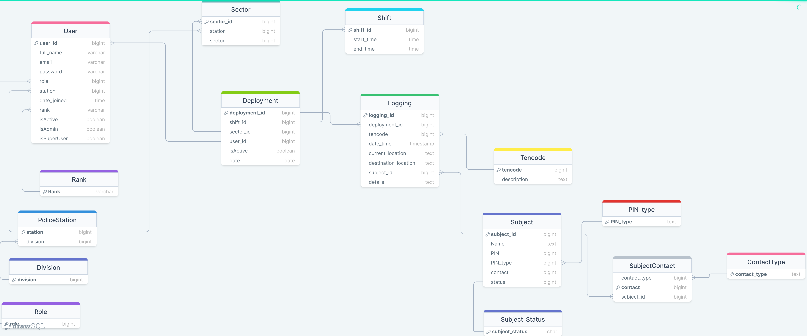

</details>

<details>
<summary>Click to view Login Page screenshot</summary>
  
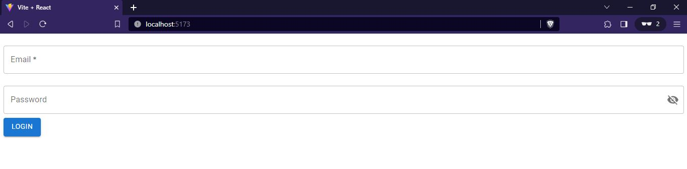

</details>

<details>
<summary>Click to view Dashboard page with no deployment screenshot</summary>

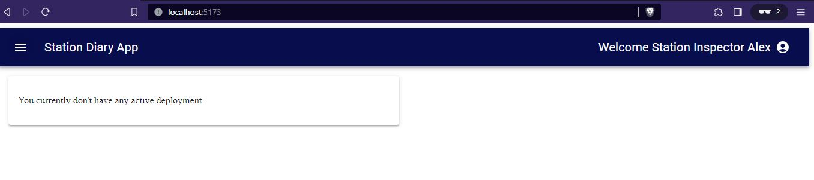
</details> 

<details>
<summary>Click to view Dashboard page with deployment screenshot</summary>
  
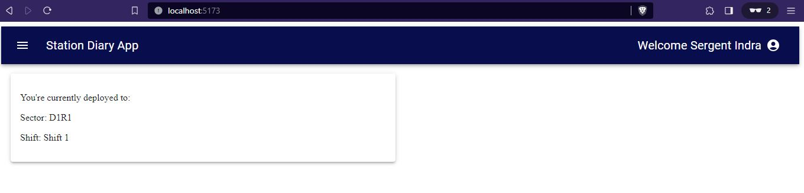
</details>  

<details>
<summary>Click to view Collapsible drawer screenshot</summary>
  
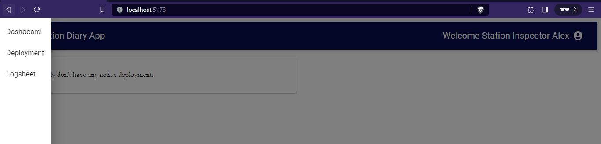
</details>

<details>
<summary>Click to view Deployment page screenshot</summary>
  
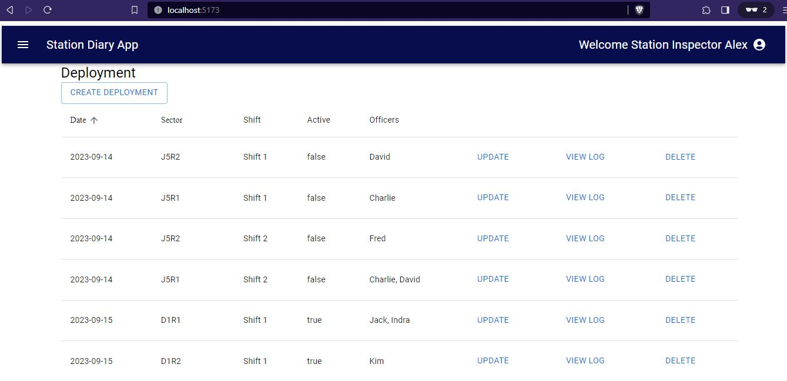
</details>  

<details>
<summary>Click to view Create Deployment Dialog screenshot</summary>
  
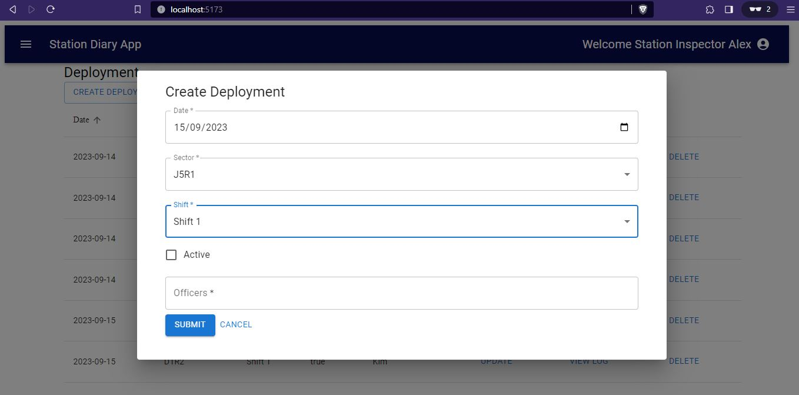
</details>

<details>
<summary>Click to view Edit Deployment Dialog screenshot</summary>
  
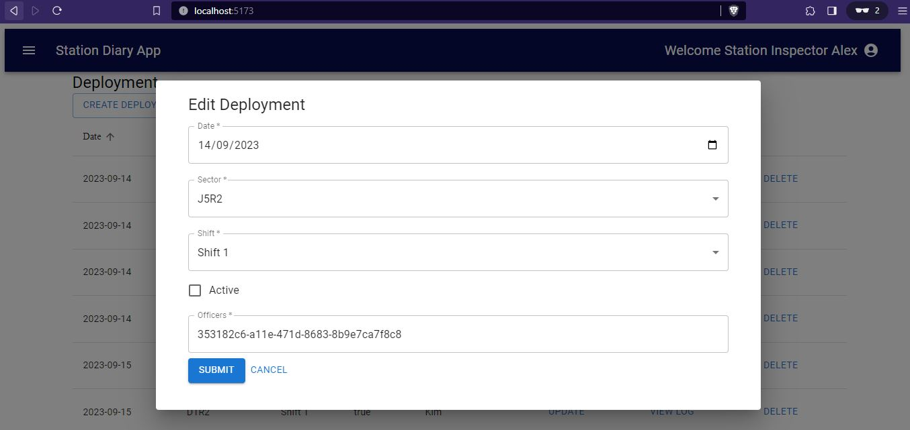
</details>

<details>
<summary>Click to view View Logsheet Dialog screenshot</summary>
  
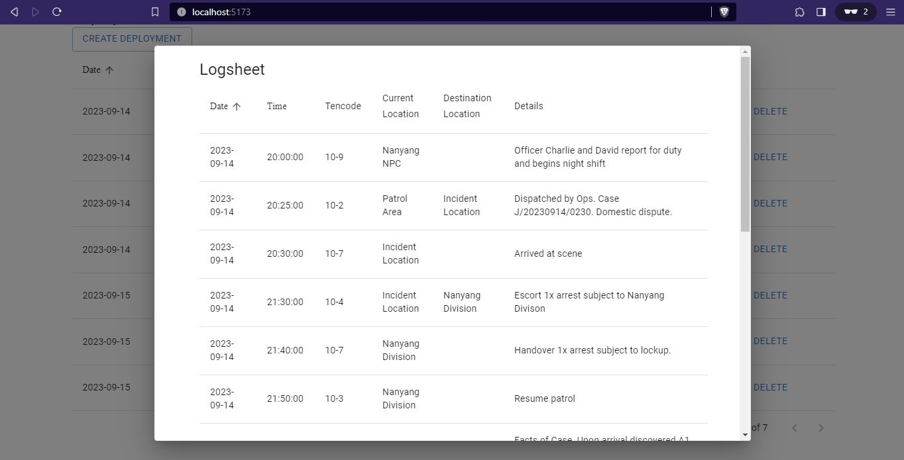
</details>  

<details>
<summary>Click to view Logsheet Dialog screenshot</summary>
  
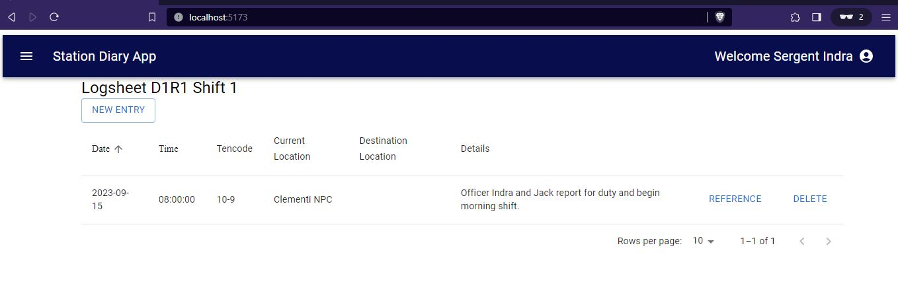
</details>  

<details>
<summary>Click to view New Log Entry Dialog screenshot</summary>
  
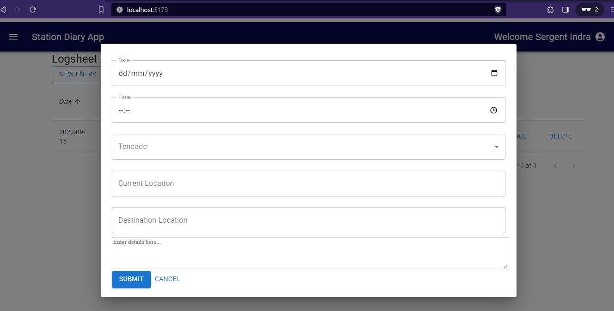
</details>  

<details>
<summary>Click to view Change Password Dialog screenshot</summary>
  
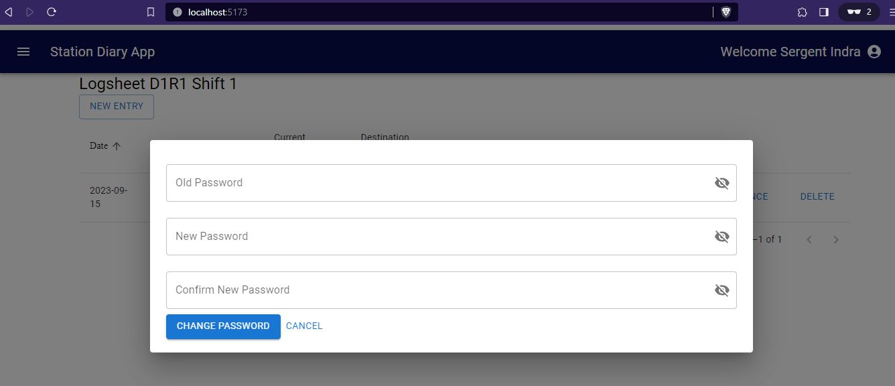
</details>  

<details>
<summary>Click to view Django Admin Page screenshot</summary>
  
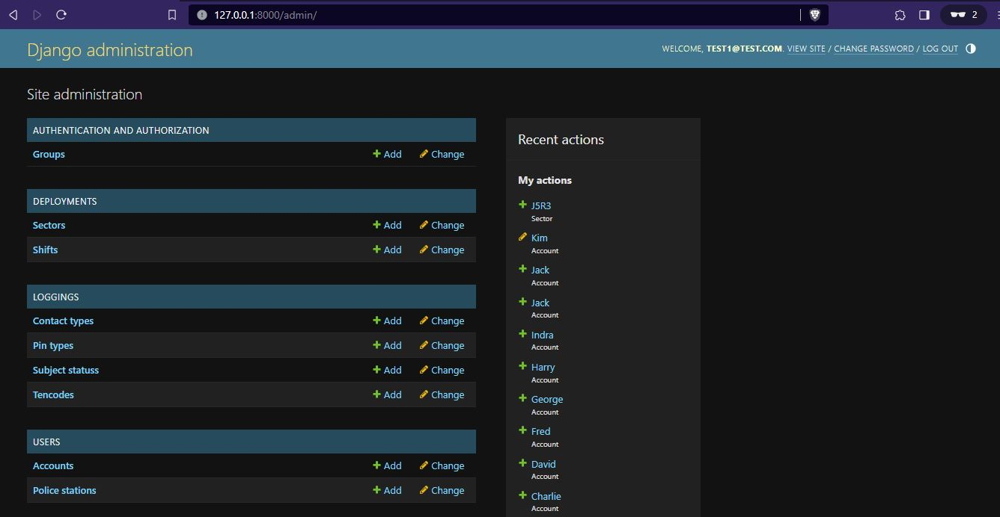
</details>  

<details>
<summary>Click to view Django Admin Page Create New Account screenshot</summary>
  
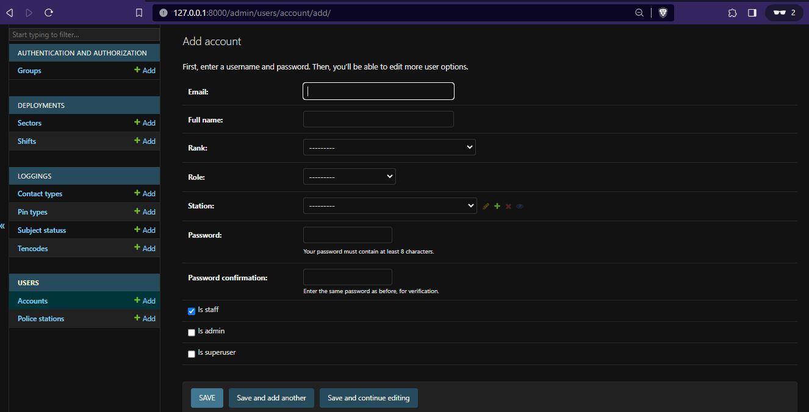
</details>  

<details>
<summary>Click to view Django Admin Account Page screenshot</summary>
  
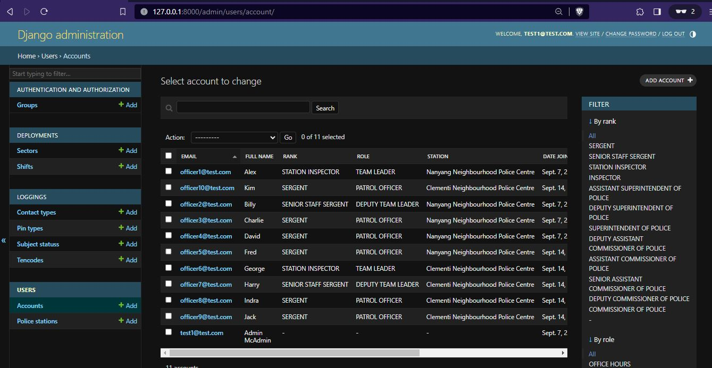
</details>  

# Backend
## Getting Started
## Installation

requirements.txt
```
asgiref==3.7.2
Django==4.2.4
django-cors-headers==4.2.0
djangorestframework==3.14.0
djangorestframework-simplejwt==5.3.0
psycopg2-binary==2.9.7
PyJWT==2.8.0
python-decouple==3.8
pytz==2023.3.post1
sqlparse==0.4.4
tzdata==2023.3
```
```
pip install django-cors-headers
pip install djangorestframework
pip install djangorestframework-simplejwt
pip install psycopg2-binary
pip install python-decouple
```

## Usage

# Frontend
## Getting Started
## Installation
package.json

**Dependencies**:

1. `@emotion/react` (Version 11.11.1)
2. `@emotion/styled` (Version 11.11.0)
3. `@mui/icons-material` (Version 5.14.8)
4. `@mui/material` (Version 5.14.8)
5. `jwt-decode` (Version 3.1.2)
6. `react` (Version 18.2.0)
7. `react-dom` (Version 18.2.0)
8. `react-router-dom` (Version 6.15.0)

.env file
```
VITE_SERVER=http://127.0.0.1:8000/
```

run installation
```
npm i
``` 

## Usage

